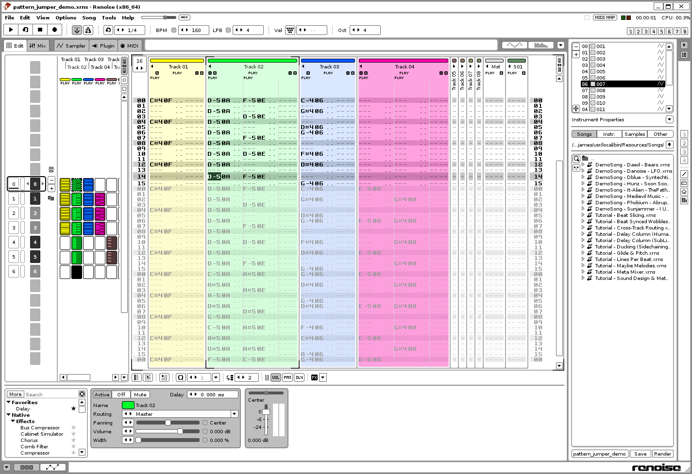
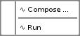
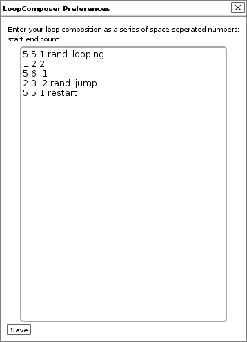

# Loop Composer

Loop Composer lets you define a sequence of pattern-range loops.

Stuff is still shaping up.

Download a packaged version from [the Neurogami software page](http://neurogami.com/code) when it's suitable for general use.

# Usage

Install the tool.

Create a song with multiple patterns

Navigate the Tool menu to `Tools:Neurogami:LoopComposer:Compose`

This brings up the composition editor.

It's super basic.

It's a single text field.

A composition is a series of lines.

Each line has three numbers, separated by spaces.

You may add an optional fourth item: the name of a function.

For example:

      0 2 2
      4 4 1 rand_looping
      3 4 2
      1 1 2
      4 5 1 rand_jump
      0 0 1
      5 5 1 restart
      # This is a comment

The first two numbers are the start and end patterns for a loop.

The third number is how many times that loop should run before moving on to the next loop.

The optional function name will get called after the loop has run the given number of times.  

Blank lines are (or should be) ignored.  Same for lines that start with "#".

Patern numbers correspond to what you see in the Renoise editor; they begin with 0.

(This can be confusing if you are doing things by code because Lua begins indexing with 1. Why oh why did the Renoise devs decide patterns in the editor should begin with 0?)

The code does not try very hard to catch or fix possible mistakes.

Once you have created a composition, click the "Save" button.

Navigate back to the `LoopComposer` menu and click "Run" to start your composition.

There is also `Stop` menu option that clears the tool timer (the song, however, will keep playing).

### Built-in helper functions

These are the helper functions defined so far:

 `restart`: Resets the loop pointer back to the first loop defininition in your compostion.

 `rand_looping`:  Defines a 50/50 change of resetting the loop pointer back to the current loop definition

 `rand_jump`: Sets the loop pointer to a random loop in your composition

### Extending the helper functions

With v0.4 there is the option of adding your own custom Lua code.

You need to first create the directory `~/.renoise/<version>/Scripts/UserConfig`

(This is the same ad-hoc directory used by [Configgy.](https://github.com/Neurogami/renoise-ng/tree/master/lua/com.neurogami.Configgy.xrnx))

The custom code file needs to named using the following convention: `<base-name-of-song-file>_LC.lua`

For example, if you have a song file `loop-composer-demo-somg.xrns` then the corresponding helper file would be named `loop-composer-demo-somg_LC.lua`.

You can put whatever you like there.  The tool looks to see if a matching code file exists for each loaded song and if found it is automatically loaded.

Such helper files have access to all the code defined in the tool as well as the Renoise scripting API.

Here's an example file:

    pattern_loop_counter = 1
    max_count = 5

    function end_after_max()
      pattern_loop_counter = pattern_loop_counter + 1
      if pattern_loop_counter > max_count then 
        LoopComposer.clear()
        renoise.song().transport:set_scheduled_sequence(#renoise.song().patterns)
      else
        LoopComposer.set_next_loop()
      end
    end

Suppose you have a loop composition that uses some random jumping as well as the `restart` command.  The function defined here can be used to track how often a given loop line is executed, and force the song to the last pattern after some maximum number of loop executions.

# Author

Copyright James Britt / Neurogami - james@neurogami.com

## Licence

[MIT License.](http://opensource.org/licenses/MIT)

Feed your head

Hack your world

Live curious

