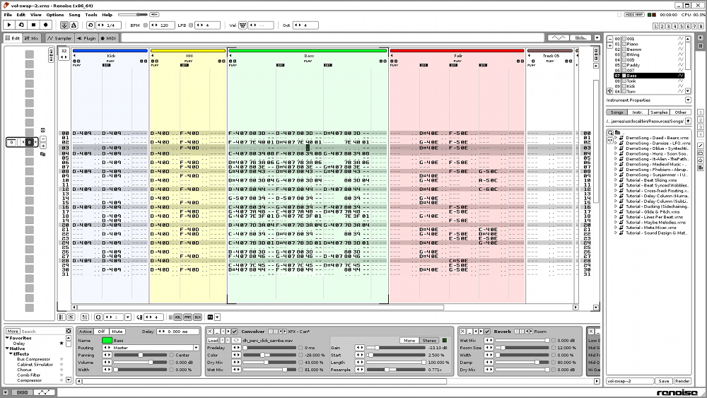
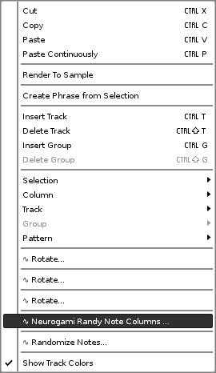
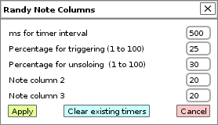

# Randy Note Columns

## Description

Randy Note Columns works with a track's note columns.  It will set up a Renoise timer function that will randomly select a note column to play solo for that track.  The select note column will then stay solo for some random interval.

### Background 

Many years ago, in the time of Windows XP, there was a company named Sseyo (yes, spelled like that) who released a product called Koan.

Koan was a tool for generating music.  You provided assorted parameters (tempo, scale, odds for this or that change occurring), hit a button, and out came music.

This is a gross simplification.  The range of options was terrific; so much so that getting it produce decent results was a challenge.  Things tended towards either quite predictable or simply meandering.  (Not that these are always bad qualities ...)

There was one  feature that stood out for creating interesting backing tracks.  You could define, say, a drum pattern, but provide alternate takes (so to speak).  For these alternate takes you could assign the odds of each playing.  You might have a steady snare drum as the main track but provide some alternate takes that offered a few flourishes (rolls, rim hits).  When you played the piece there was a somewhat more natural result because of the periodic variation withing the more steady behavior.

Randy Column Notes attempts to provide a similar feature for Renoise.  It assumes that a given track has multiple column notes, but that only one note column should be active at a time; all other should be muted.  

The first column is assumed to be the default.  All the others are the randy columns and should be mute by default.

You can have as many of these sorts of track setups as you like.  Because of the "one column un-muted at a time" requirement these tracks cannot be polyphonic. 

Know that this is an early release. It works but needs some tweaking in the UI to make it nicer.

## Usage

Set up a song.  Set up a track with multiple note columns.  Mute all but the first note column in that track. This is to be the default setting for the track.

Click on the track, then right-click to get the context menu.  

(Ignore all those "Rotate" entries. Experiments in progress.)

Click on "Neurogami Randy Note Columns" to get a pop-up window for setting parameters.

The tool is still evolving so the UI is likely to change.  But the basics are in place.

The idea is that for any given track, a function is setup to be called at fixed intervals (using `renoise.tool():add_timer`).

The first tool parameter is the timer interval, in milliseconds.  

The second parameter is the percentage likelihood (currently as a number for 0 to 100) that the note column should change from the default first column to one of the other note columns. This is the "percentage for triggering".

Each time the timer function is called it grabs a random number from 1 to 100. If this number is lower than the provided percentage for triggering then the code picks what other column to solo.  If there is only one other column then that's the one that comes to life.

The third parameter is the odds (again, a number from 1 to 100) of reverting back to the first note column if it's not currently playing.

The remaining  parameters are for relative odds of the non-first note columns being selected.  If, for example, the track has three note columns then you'll see fields for "Note column 2" and Note column 3".

Whatever numbers you put there get normalized so that they represent percentages that total 1.0. 

For example, if you entered 30 and 40 for the two columns they'd get converted to 0.43 and 0.57.

Yeah, the UI needs to change to make this a little more intuitive.  But it works.

So, recap: Decide how often the function passed to the timer gets called.  On each call the function looks to see if note column one is muted. If not, it checks a random number to see if it should mute the first note column and un-mute on of the others. If there is more than one other column to switch to then the assigned relatively odds are used to see which one to pick.

If the first note column is already muted then that second percentage option is used to decide if current;y playing note column should be muted and the first note column restored.
 
A use case might go like this:

Set up a track with a snare drum. The first note column is a steady 4/4.  A second note column, mute by default, has a drum roll. A third note column, also mute by default, just adds a secondary snap.

You only want the snare to alter every so often, so you set the timer interval to 1000 milliseconds and the "percentage for triggering" to 20.   This means once a second (more or less) the function will get called, and on each call there's a 20% change that if the first note column is playing then it will be switched out for either the 2nd or 3rd note column.

You would prefer the extra snap come in a little more often then the roll, so you set the note column values to 30 and 50 because you are poor at math and those numbers just feel right.  The code will convert them to the percentages 0.37 and 0.63, meaning the extra snap is almost-but-not-quite twice as likely to picked as the drum roll.

Since the timer function gets called every second, if either the second or third note column is playing then it will remain playing for a full second. Since you don't want this to go on very long you set the "percentage for unsoloing" to 90.  In practice then you may have this switch-up lasting two second, and just maybe three, but changes are it will jump back to the first note column almost every time,

You then click on "Apply" to add the timer function and start the fun.

Percetnage for triggering

Percentage for unsoloing

For each note column (other than the first column) there's a field for the relative odds of selection.  There

## Author

Randy Note Columns was written by James Britt / Neurogami.

Source code can be found [here](https://github.com/Neurogami/renoise-ng/tree/master/lua/com.neurogami.RandyNoteColumns.xrnx).

Send questions and comments to james@neurogami.com

## Licence

MIT License.

Feed your head

Hack your world

Live curious

