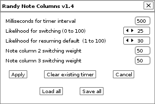

# Randy Note Columns

## Description

Randy Note Columns works with a track's note columns.  It will set up a Renoise timer function that will randomly select a note column to play solo for that track.  The select note column will then stay solo for some random interval.

Download a packaged version from the [Neurogami code page.](http://neurogami.com/code/)

** Note **

This is still evolving.  There may be stuff that is a bit wonky.

### Background 

Many years ago, in the time of Windows XP, there was a company named Sseyo (yes, spelled like that) who released a product called Koan.

Koan was a tool for generating music.  You provided assorted parameters (tempo, scale, odds for this or that change occurring), hit a button, and out came music. (Koan is now gone; Sseyo has transmogrified into Intermorphic, who now offer Noatikl, the Koan replacement.)

This is a gross simplification.  The range of options was terrific; so much so that getting it to produce decent results was a challenge.  Things tended towards either quite predictable or simply meandering.  (Not that these are always bad qualities ...)

There was one feature that stood out for creating interesting backing tracks.  You could define, say, a drum pattern, but provide alternate takes (so to speak) for each instrument.  For these alternate takes you could assign the odds of each playing.  You might have a steady snare drum as the main track but provide some alternate takes that offered a few flourishes (rolls, rim hits).  When you played the piece there was a somewhat more natural result because of the periodic variation within the overall steady behavior.

Randy Note Columns attempts to provide a similar feature for Renoise.  It assumes that a given track has multiple column notes, but that only one note column should be active at a time; all others should be muted.  

The first column is assumed to be the default.  All the others are the randy columns.

You can have as many of these sorts of track setups as you like.  Because of the "one column un-muted at a time" requirement these tracks cannot be polyphonic. 

## Usage

Set up a song.  Set up a track with multiple note columns.  Mute all but the first note column in that track. This is to be the default setting for the track.

Click on the track, then right-click to get the context menu.  

(Ignore all those "Rotate" entries in the picture. Experiment in progress.)

Click on "Neurogami Randy Note Columns" to get a pop-up window for setting parameters.

The tool is still evolving so the UI is likely to change.  But the basics are in place.

The idea is that for any given track a function is set up to be called at fixed intervals (using `renoise.tool():add_timer`).

The first tool parameter is the timer interval, in milliseconds.  

The second parameter is the percentage likelihood (currently as a number for 0 to 100) that the note column should change from the default first column to one of the other note columns. This is the "Likelihood for switching".

Each time the timer function is called it grabs a random number from 0 to 100. If this number is lower than the provided percentage for triggering then the code picks what other column to solo.  If there is only one other column then that's the one that comes to life.

The third parameter is the odds (again, a number from 0 to 100) of reverting back to the first note column if it's not currently playing. This is the "Likelihood for resuming default."

The remaining parameters are for relative odds of the non-first note columns being selected.  If, for example, the track has three note columns then you'll see fields for "Note column 2 switching weight" and Note column 3 switching weight."

Whatever numbers you put there get normalized so that they add up to 100%. 

For example, if you entered 30 and 40 for the two columns they'd get converted internally to 43% and 57%.  

This means that if a switch is to occur there will be a 43% chance of selecting column 2, and a 57% chance of picking column 3.

So, recap: Decide how often the function passed to the timer gets called.  On each call the function looks to see if note column one is muted. If not, it checks a random number to see if it should mute the first note column and un-mute on of the others. If there is more than one other column to switch to then the assigned relatively odds are used to see which one to pick.

If the first note column is already muted then that second percentage option is used to decide if currently soloed note column should be muted and the first note column restored.
 
A use case might go like this:

Set up a track with a snare drum. The first note column is a steady 4/4.  A second note column, mute by default, has a drum roll or triplets. A third note column, also mute by default, just adds a secondary snap (e.g. 2/4 beat).

You only want the snare to alter every so often so you set the timer interval to 1000 milliseconds and the likelihood for switching to 20.   This means once a second (more or less) the associated function will get called, and on each call there's a 20% chance that if the first note column is playing then it will be switched out for either the 2nd or 3rd note column.

You would prefer the extra snap come in a little more often then the roll, so you set the note column values to 30 and 50 because you are poor at math and those numbers just feel right.  Internally the code will convert them to 37% and 63%, meaning the extra snap is almost-but-not-quite twice as likely to be picked as the drum roll.

Since the timer function gets called every second, if either the second or third note column is playing then it will remain playing for a full second (i.e things stay the same until the timer function gets called again).   

Since you don't want this to go on very long you set the "Likelihood for resuming default" value to 90.  In practice then you may have this switch-up lasting two second, and just maybe three, but chances are it will jump back to the first note column almost every time.

You then click on "Apply" to add the timer function and start the fun.

You will likely need to play around with different values to get something that sounds right to you. To change an existing timer function just bring up the UI again and edit the values, then click "Apply" to replace the current timer with a new function with the new values.

To remove an existing timer function for a given track you bring up the UI and click the "clear existing timer" button. It will clear the timer for the currently selected track.

### Saving and loading

When you load a song all existing Randy timers are cleared.  If you have a set of parameters you like and want to reuse in the future you can save them using the  "Save all" button.

This saves the settings for _all_ of the column-switching timers for all of the tracks in the current song.  The settings are saved to a file based on the file name of the current song.

To reload these settings use the "Load all" button.  It looks for a saved configuration file based on the name of the currently loaded song. If it finds on it loads the settings and reestablishes all of the timers.

## Still to come

There was some OSC stuff in the code; this project was a spin-off from [OSC Jumper](http://neurogami.com/blog/neurogami-osc-jumper-version-1-released.html).    That tool has been acquiring assorted OSC handlers, and one of them was a way to set up a note-column timer.

It worked, crudely.  It was more proof of concept than anything else. To do it right it needed a good way to set up the various parameters. 

So it became its own tool.  But with that in place it is now easier to understand what parameters are needed, such that sending an OSC message to manipulate such timers is much simpler.  You need to send a track number, a timer interval, a function-execution percentage number, odds for selecting each of the non-default note columns, and the odds for returning back to the default.

Yes, that's a bunch of stuff, but it would (presumably) be done programmatically so it's not a big deal.  The only really tricky part is in sending a variable-length array of note-column odds.  (The OSC spec has something for arrays.)

The intial expectation was that an OSC API would be added to Randy Note Columns once the code settled down, but it presents a problem: how many OSC servers should be running for a Renoise song, and how would clients be able to make use of all of them?  

That's actually _two_ problems but they're coupled.

If, for example, you're using OSC Jumper because it offers super-bad song manipulation behavior, you can still use the built-in Renoise OSC handlers because OSC Jumper knows how to proxy such calls.  So there are two OSC servers running (the built-in Renoise server and the OSC Jumper server) but an OSC client need only be concerned with one (the Jumper server) because that one will effectively handle messages for both of them.

But if you add another OSC server in there, what happens? Which of these tools acts as the OSC point of entry, and how does it know to proxy to all other OSC servers?

The solution for now is to assume that all new OSC behavior should go into OSC Jumper (which seems due for a name change).  OSC Jumper can leverage behavior defined in other tools using the "code-sharing hack.":http://www.neurogami.com/blog/neurogami-sharing-lua-files-in-renoise.html

The upside is that the OSC device code in OSC Jumper does not have to be duplicated in Randy Note Columns (and whatever other number tools that might want an OSC API).  That stays in one place.  It means there's just one OSC server a client needs to care about.

The downside is that if you want to use Randy Note Columns via OSC you have to install another tool.

The removal of duplication, however, seems like a much bigger gain.

## Author

Randy Note Columns was written by James Britt / Neurogami.

Source code can be found [here](https://github.com/Neurogami/renoise-ng/tree/master/lua/com.neurogami.RandyNoteColumns.xrnx).

Send questions and comments to james@neurogami.com

## Licence

MIT License.

Feed your head

Hack your world

Live curious

